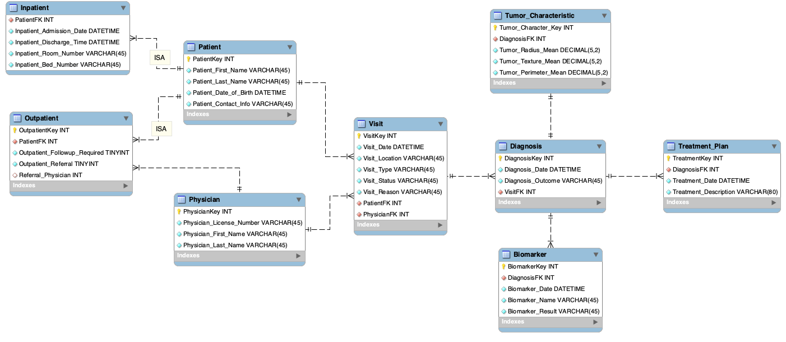

# 📊SQL Based Analysis of Tumor Characteristics, Diagnosis, and Treatment Patterns in Breast Cancer

## Project Overview
This project analyzes breast cancer data using SQL to uncover patterns in tumor characteristics, diagnosis, and treatment outcomes. By leveraging SQL, we aim to improve clinical decision-making and patient outcomes.

- **`data/`**: This folder contains all data-related files.
- **`docs/`**: This folder contains all the diagrams (such as the ER diagram) related to the database design.
- **`scripts/`**: This folder contains several MySQL scripts for generating reports based on the data analysis.
- **`reports/`**: This folder contains the outcomes of queries (.csv, .png)

## Data Resources
- **Dataset**: [Kaggle Breast Cancer Dataset](https://www.kaggle.com/datasets/yasserh/breast-cancer-dataset)
- **Entities**: 9 entities, including patient data and tumor characteristics
- **Database**: MySQL Workbench

## Key Reports
- **Tumor Characteristics**: Comparison of benign vs malignant tumors based on size, texture, and perimeter.
- **Tumor Markers**: Average values of biomarkers (CEA, CA153, CA27-29) for benign and malignant diagnoses.
- **Physician-Patient Analysis**: Number of patients treated by each physician for different tumor types.
- **Treatment Type Summary**: Count of treatment types (RT, CT, HT, S) by visit type (inpatient vs outpatient).
  
## ER Diagram
The ER diagram visualizes the relationships between entities like patients, physicians, and tumor characteristics.

## Setup
1. Clone the repository.
2. Create the ER diagram and forward engineer into MySQL workbench
3. Import the CSV file located in the `data/` folder into MySQL Workbench.
4. Run SQL queries in the provided `scripts/` folder.

## Technologies
- **SQL** (MySQL)
- **Python** (for data analysis)
- **Tableau** (for visualizations)

## License
This project is licensed under the MIT License.

